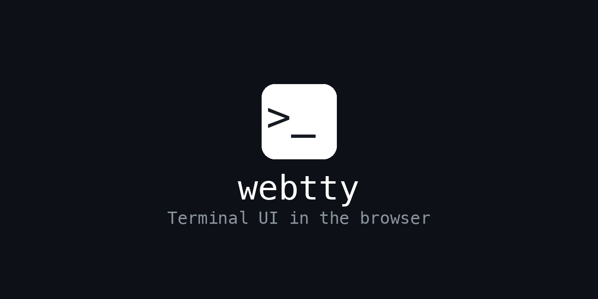

# webtty

Terminal UI in the browser. Run CLI/TUI applications in a browser tab, across platforms.

```sh
npx webtty                # open main session in the browser
npx webtty go [id]        # open a specific session by id
```

## Development

Build emits source maps (`dist/**/*.js.map`), so you can debug against the built output directly — no minification, original TypeScript line numbers preserved.

```
bun run build
bun --inspect run dist/server/index.js
# or
node --inspect dist/server/index.js
```
